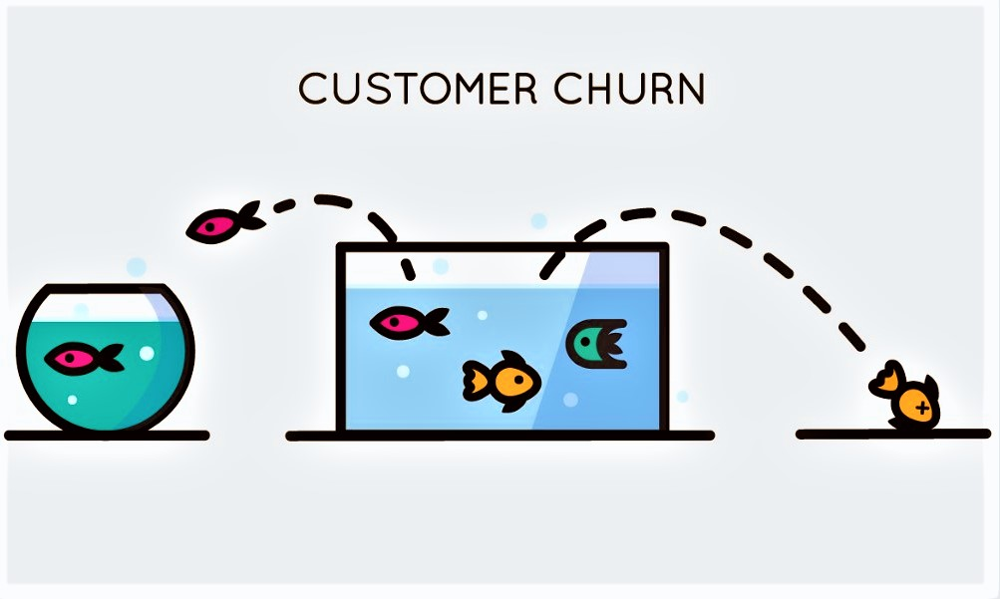
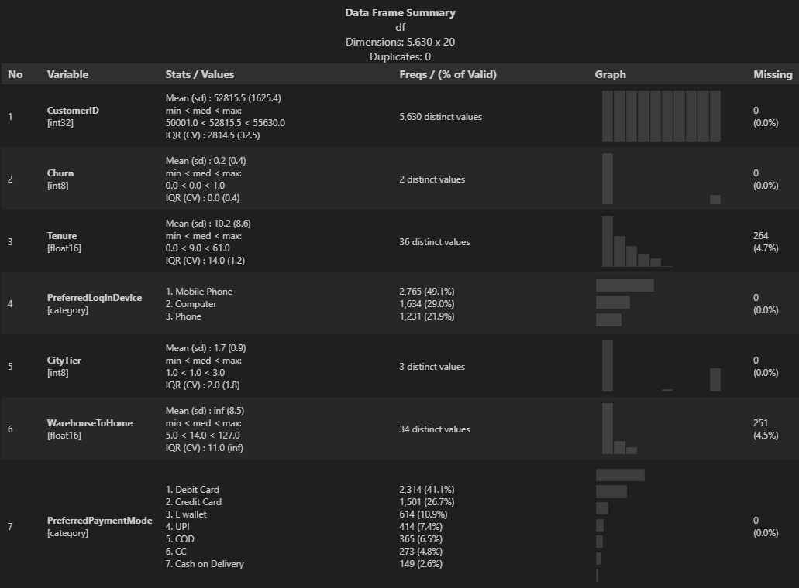
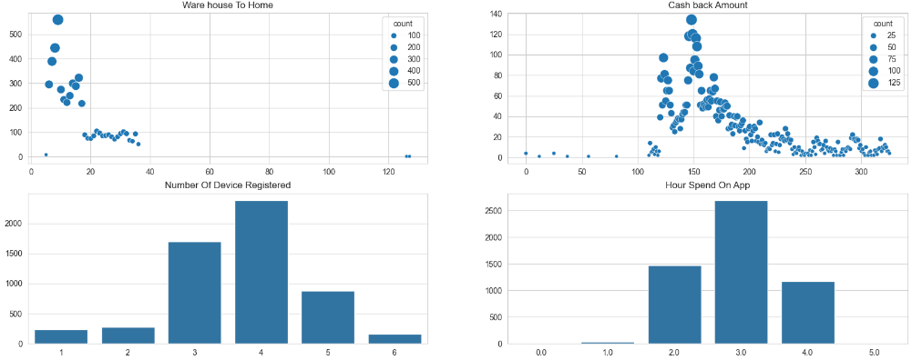

# Análise de base de ecomm para modelos de previsão de churn
A base de dados é originaria do [Kaggle](https://www.kaggle.com/datasets/ankitverma2010/ecommerce-customer-churn-analysis-and-prediction), disponibilizada para estudos relacionas as modelos preditivos, focando na previsão de usuários que se tornaram churners ou não, e o que pode leva-los a serem churners.

**O que você vai encontrar nessa pasta?**
Um notebook com uma análise descretiva e tratamentos realizados nos dados, e dois arquivos Excel, sendo o primeiro o arquivo original do Kaggle e o segundo o resultado final do trabalho feito nesse notebook.

**O que é o churn?**

Ato de um cliente deixar de consumir produtos e serviços de uma empresa por motivos como: insastifação ou encontrar melhor preços no concorrente. Esses clientes são conhecidos como "churners".

**Resumo do Notebook**

Os seguintes passos foram feitos para chegar no resultado final: 
1. Importar as bibliotecas e o dataset.
2. Otimizar o tipo de cada variável do dataset para reduzir a memória e tempo usado para rodar as células.
3. Analisar as características descretivas dos dados para compreender melhor os dados existentes na base.
4. Tratar e ajustar dados com nomenclaturas diferentes que deveriam estar em uma única categoria e agrupar outras informações.
5. Transformar variáveis categoricas com informações textuais em valores binários. Para colunas com diversas categorias foi utilizado a função **One Hot Encoder** da biblioteca **Sklearn Processing**.
6. Preencher os valores vazios existentes em diversas colunas do dataframe com o uso do **KNN Imputer**.
7. Otimizar novamente os tipos de cada variável novamente e gerar o arquivo final em formato xlsx (excel).

**Ponto importantes observados durante a análise drescretiva**
- A base de dados contém 5.630 amostras e 20 variáveis para cada, e existem algumas dessas que tem dados faltantes.
- Cada observação representa um usuário único? Cada observação representa um usuário único e não repetido.
- 60,1% dos usuários são homens e a maioria são casdados e 1/3 solteiros.
- 71% dos usuários preferem realizar as comprar pelo celular e utilizando cartões de crédito e débito.
- Notebook e Acessórios, Celulares e Moda são as principais categorias preferidas pelos usuários no último mês.
- Quantos cupons foram usados pelos usuários no último mês? Cerca de 82% dos usuários utilizaram entre 0 a 2 cupons no úlimo mês para realizar compras nessa plataforma.
- Quantos pedidos foram feitos pelos usuário no último mês? 70% dos usuários fizeram no máximo dois pedidos até o momento.
- Quanto tempo faz desde a última compra feita? A maior parte dos usuários retornaram faz pouco tempo para realizar uma compra.
- Houve crescimento percentual na quantidade de pedidos gerados? O mínimo de crescimento encontrado foi de 11% e o máximo foi 26%, mas a maior parte dos usuários aumentaram entre 12% a 15% a quantidade de compras feitas em comparação ao último ano.
- A quanto tempo os usuários estão nesse e-commerce? Os usuários estão principalmente a menos de um mês ou no primeiro mês como clientes. 
    - Parece que a flag se usuários é ou não um churner é baseada está no tempo que ele é usuário do e-commerce. Esse suspeita surgiu no gráfico acima, usuários com menos de 25 meses são possíveis churners e acima de 25 meses não são mais considerados churners.
- O quão distante fica o armazém dos produtos fica do domicílio dos usuários? O armazém fica no máximo a 20km do domicílio da maior parte dos usuários. **(imagino que a métrica esteja em quilometros)**
- Quanto tempo é gasto no site/app? A maioria dos usuários passam, aproximadamente, entre 2 a 4 horas.

**Gráficos gerados para as análises**

**Dicionário explicando cada variável ao final da análise**
- **CustomerID:** Identificador único dos usuários.
- **Churn:** Sinalização se o usuário deixou de ser cliente ou não. 0 para não e 1 para sim.
- **Tenure:** Tempo que os usuários estão (ou estavam) como clientes da empresa.
- **PreferredLoginDevice:** Método preferencial para logar ao e-commerce. 0 para computer e 1 para mobile.
- **CityTier:**	O nível da cidade.
- **WarehouseToHome:** Distância entre o armazém e os domicílios.
- **Gender:** Gênero dos usuários. 0 para mulher e 1 para homem.
- **HourSpendOnApp:** Quantidade de horas gastas pelos usuários no app ou website do e-commerce.
- **NumberOfDeviceRegistered:**	Total de dispositivos registrado por um usuário.
- **SatisfactionScore:** Pontuação, entre 0 e 5, da satisfação dos usuários.
- **MaritalStatus:** Estado civil dos usuários. 0 para solteiro e 1 para casado.
- **NumberOfAddress:** Total de endereços registrados.
- **Complain:** Se houve reclamações no último mês. 0 para não e 1 para sim.
- **OrderAmountHikeFromlastYear:** Crescimento percentual de pedidos em relação ao último ano.
- **CouponUsed:** Quantidade de cupons utilizados no último mês.
- **OrderCount:** Total de pedidos feitos no último mês.
- **DaySinceLastOrder:** Quantidade de dias desde a última compra.
- **CashbackAmount:** Valor médio do cashback do último mês.

**Variáveis dummyzadas em colunas**
- **PreferredPaymentMode:** Formato de pagamento preferencial.
    - PreferredPaymentMode_Cash
    - PreferredPaymentMode_Credit
    - PreferredPaymentMode_Debit
    - PreferredPaymentMode_E wallet
    - PreferredPaymentMode_UPI
- **PreferedOrderCat:**	Categoria preferencial dos usuários do último mês.
    - PreferedOrderCat_Fashion
    - PreferedOrderCat_Grocery
    - PreferedOrderCat_Laptop & Accessory
    - PreferedOrderCat_Mobile
    - PreferedOrderCat_Others