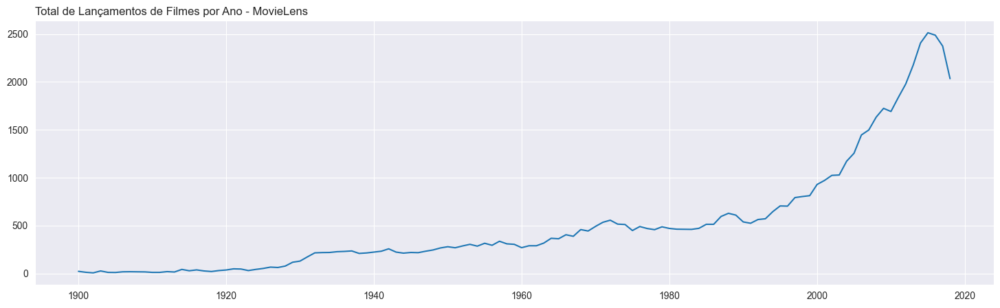
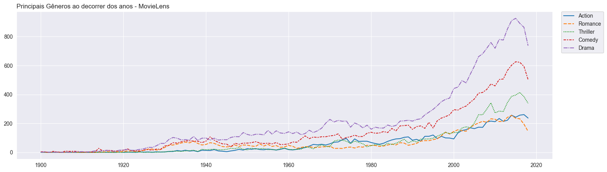
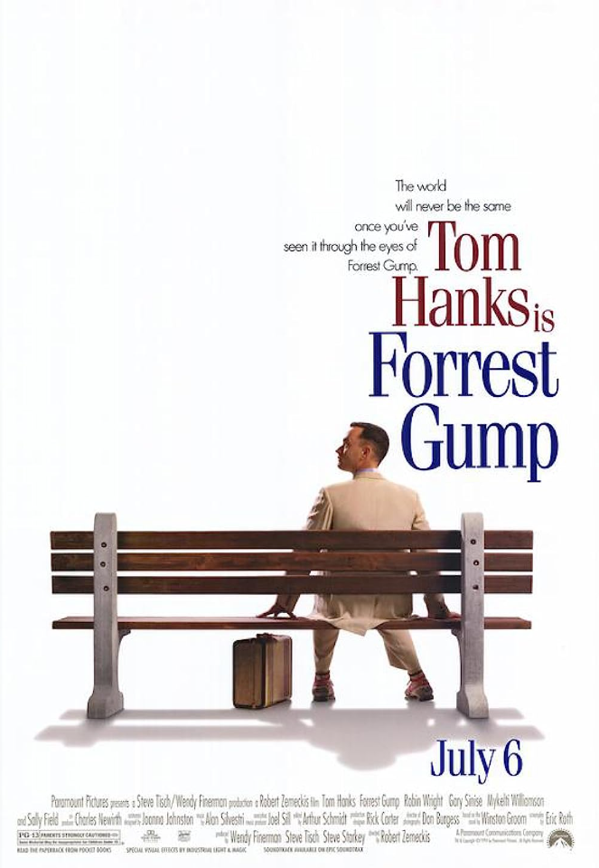
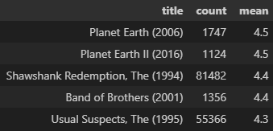

# **Análise sobre os filmes do MovieLens**
Essa análise tem apresenta de forma interesssante o uso do Python para a análise de dados, apresentando como manipular informações, tratamentos de texto, gerar gráficos e insights com o uso do Python!

## **Tratamentos de Dados**
- Otimização dos tipos de cada variável para melhor processamento.
- Tratamento de texto para obter o ano de lançamento de cada filme e obter os gêneros em novas colunas para as análises seguintes.
- Agrupamento das informações de notas.
- Cruzamento das bases de filmes e notas para verificar o ranking dos filmes.

## **Insights encontrados**
A base tem registro de filmes entre 1900 até 2019, mostrando que a popularização do cinema gerou o crescimento na quantidade filmes lançados. Principalmente em anos recentes, que as ferramentas para fazer filmes ficaram mais acessíveis.

Os gêneros mais importantes ao decorrer dos anos foram Drama, Comédia, Suspense, Ação e Romance.

## **O filme mais votado é Forest Gump (1994)!**

Interessante que o top 5 mais votados da plataforma são todos filmes da década de 1990. O Forest Gump é seguido por Um Sonho de Liberdade (1994), Pulp Fiction (1994), O Silêncio dos Inocentes (1991) e Matrix (1999).

## **Filmes com Maior Nota Média**

Os Planet Earth são documentários produzidos pela BBC trantando sobre temas relacionados a natureza.

**Além de outros insights que vocês podem encontrar no notebook dessa pasta!**

## **Informações Adicionais**
A base de dados é original desse [Kaggle](https://www.kaggle.com/datasets/garymk/movielens-25m-dataset?resource=download), disponibilizando variás informações possíveis de dados sobre filmes do MovieLens. Nessa pasta será focado apenas nos arquivos **movies** e **ratings** que tratam sobre os filmes existentes na plataforma, seus gêneros e avaliações.

Infelizmente os arquivos são pesado demais para estar no Github, é preciso baixar do Kaggle.