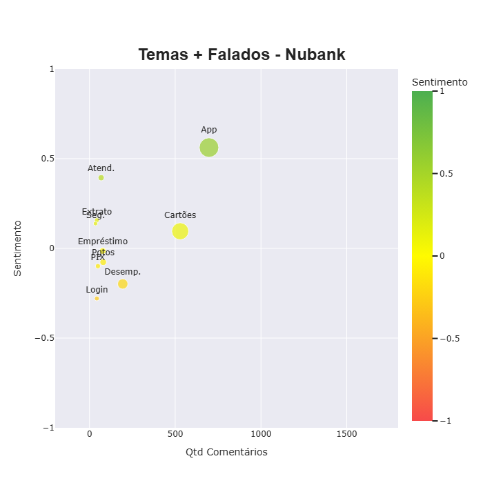

# **Análise de Sentimento e Classificação de Temas de Comentários de Apps**
**O que você vai encontrar nessa pasta?**

Uma análise que busca extrair insights de comentários públicos de aplicativos originados da Play Store de bancos/fintechs e operadoras de telefonia no Brasil.

A análise observa - após extração dos comentários, tratamentos e aplicação de modelos de texto em português - os sentimentos e emoções dos comentários dos usuários em relação aos serviços que contrataram e decidiram expressar publicamente suas percepções na Play Store. 

Além da análise com insights dos sentimentos e emoções dos comentários, foi também aplicado uma classificação de temas correlatos a bancos/fintechs e operadoras de telefonia no Brasil para compreender o que os usuários, em média, pensam sobre esses assuntos.

## **Passo a Passo Aplicado**
**Extração e Tratamentos de Texto**
- Extração de uma amostra significativa de comentários por empresa na Play Store
    - No meu **[Github](https://github.com/PedroReste/data_eng_insights/tree/main/web_scraping_comentarios_apps)** tem um exemplo de como extrair dados da Play Store e App Store.
- Função de tratamento de texto: tradução de emojis, remoção de stopwords, lemmentização e etc

**Análise de Sentimentos e Emoções**
- Verificação do período de comentários para cada empresa
    - Na extração é extraído um volume específico de comentários e dependendo do app, podendo ter um período maior ou menor dos comentários analisados.
- Aplicação da função com os modelos de sentimento e emoção do Pysentimiento
- Análise por sentimento: visão geral e detalhada de sentimentos por empresa
- Análise por emoção: agrupamento das diversas emoções em grandes emoções gerais e visão por empresa

**Classificação de Temas**
- Criação manual dos temas e aplicação da função de classificação de temas
- Geração do sentimento médio por tema e visão em gráfico de dispersão

## **Como Funciona os modelos de Sentimento e Emoções?**

Os modelos utilizados para extrair sentimentos e emoções são originados da biblioteca **[Pysentimiento](https://github.com/pysentimiento/pysentimiento)**. Essa lib é baseada em modelos transformer **BERT** (Bidirectional Encoder Representations from Transformers) da Google que são estruturados em três pontos principais:
- **Bidirecional**: entende uma palavra com base nas palavras à esquerda e à direita ao mesmo tempo.
- **Pré-treinado**: treinado em tarefas como preencher palavras e prever se uma frase segue logicamente a outra.
- **Fine-tunável**: pode ser adaptado a tarefas específicas como análise de sentimento, classificação, etc.

No caso específico do Pysentimiento, é utilizado modelos BERT adptados que foram pré-treinados com bases textuais específicas (como tweets ou comentários curtos) em diversos idiomas (incluindo o português) e ajustados para ações específicas, como a classificação de sentimentos e emoções, e detecção de ironia e discurso de ódio.

## **Insights Extraídos dos apps de Bancos/Fintechs**

Na tabela abaixo apresenta um resumo geral dos dados. Na coluna de **Sentimento Médio**, resume o valor geral dos sentimentos dos comentários de cada app em uma escala de -1 e +1, de muito negativos até muito positivos, respectivamente.

<table border="1" class="dataframe">
  <thead>
    <tr style="text-align: right;">
      <th>Aplicativo</th>
      <th>Sentimento Médio</th>
      <th>Volume de Comentários</th>
      <th>Data Mais Antiga</th>
      <th>Data Mais Recente</th>
    </tr>
  </thead>
  <tbody>
    <tr>
      <td>Banco do Brasil</td>
      <td>0.45</td>
      <td>5.000</td>
      <td>26/mai</td>
      <td>12/jun</td>
    </tr>
    <tr>
      <td>Bradesco</td>
      <td>-0.04</td>
      <td>5.000</td>
      <td>23/abr</td>
      <td>12/jun</td>
    </tr>
    <tr>
      <td>C6</td>
      <td>-0.19</td>
      <td>5.000</td>
      <td>09/jan</td>
      <td>12/jun</td>
    </tr>
    <tr>
      <td>Caixa</td>
      <td>0.09</td>
      <td>5.000</td>
      <td>29/mai</td>
      <td>12/jun</td>
    </tr>
    <tr>
      <td>Inter</td>
      <td>0.33</td>
      <td>5.000</td>
      <td>09/mai</td>
      <td>12/jun</td>
    </tr>
    <tr>
      <td>Itaú</td>
      <td>-0.07</td>
      <td>5.000</td>
      <td>23/mai</td>
      <td>12/jun</td>
    </tr>
    <tr>
      <td>Mercado Pago</td>
      <td>0.31</td>
      <td>5.000</td>
      <td>18/mai</td>
      <td>12/jun</td>
    </tr>
    <tr>
      <td>Nubank</td>
      <td>0.46</td>
      <td>5.000</td>
      <td>08/jun</td>
      <td>12/jun</td>
    </tr>
    <tr>
      <td>Santander</td>
      <td>0.18</td>
      <td>5.000</td>
      <td>27/abr</td>
      <td>12/jun</td>
    </tr>
  </tbody>
</table>

**Sentimentos**
- No sentimento médio geral dos usuários, **Nubank**, **Banco do Brasil**, **Inter** e **Mercado Pago** tem um sentimento positivo, enqunato **Bradesco**, **Caixa**, **Itaú** e **Santander** são neutros. O **C6** é único com sentimento negativo entre as 9 empresas. 
- Nos comentários positivos, o top 3 apps com mais comentários positivos são **Nubank**, **Banco do Brasil** e **Inter**.
- Em contra partida, como esses são os apps com mais comentários positivos, acabam sendo também os que tem menos comentários negativos. Além desses, o **Mercado Pago** também possui poucos comentários negativos.
- Tratando de comentários negativos, observandos os que mais possuem atualmente são **C6**, **Itaú** e **Bradesco**.

- Nos sentimentos detalhados, separando os sentimentos positivos e negativos em mais ou menos intensos, alguns comportamentos se mantêm semelhantes e outros têm destaques.
- O **Banco do Brasil** que mais possuí comentários positivos (aprox. 3.6 mil), separando por intensidade, o banco tem principalmente comentários **muito positivos** (aprox. 2.2 mil), e **positivos** (aprox. 1.4 mil) logo em seguida.
- **Inter**, **Nubank**, **Mercado Pago** e **Santander** segue o mesmo comportamento, mas com a diferença menor entre comentários **muito positivos** e **positivos**.
- Nos comentários negativos, **C6**, **Itaú** e **Bradesco** lideravam nos sentimentos gerais. Na visão detalhada, os sentimentos **muito negativos** são os predominantes para essas empresas.
- Observando os sentimentos negativos, quando existem, a tendência é serem **muito negativos**, tendo poucos sentimentos com menor intensidade.

**Emoções**
- Considerando a média da probabilidade de cada emoção, para todas as empresas, o que predomina são emoções **alegres** e **neutras**.
- Como notado nos sentimentos, acaba tendo a exceção nas emoções para **C6**, **Itaú** e **Bradesco**, que possuem picos de **raiva** nos comentários.

**Temas**
- Foram classificados os seguintes temas para ser observados o sentimento médio: App, Desempenho (do App), Login, Atendimento, Segurança, Cartões, Extrato, PIX e Pagamentos.
- Após o detalhamento dos temas, app por app, a visão geral dos app foi o tema mais falado.
- A visão do aplicativo foi bastante distinta, para maioria neutra, para outros poucos negativa ou positiva.
- Quando negativo a visão geral do app, quase sempre relacionado ao desemepenho e o login do app.
- No Nubank e Mercado Pago, o tema sobre Cartões é visto com positivo. Enquanto para os demais bancos e fintechs é um tema negativo.
- Temas como Empréstimo, Extrato,e Segurança foram pouco comentados no geral.

**App com Temas com Sentimento Positivo**

**App com Temas com Sentimento Neutro**

**App com Temas com Sentimento Negativo**

